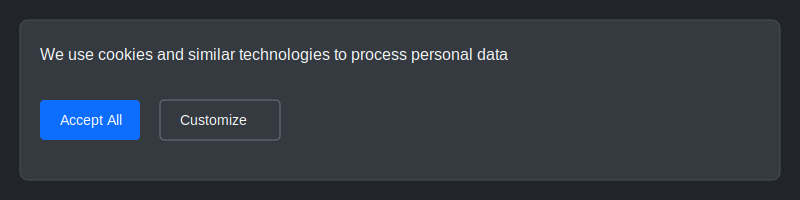
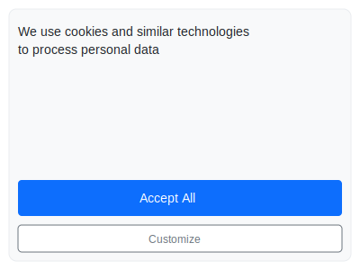
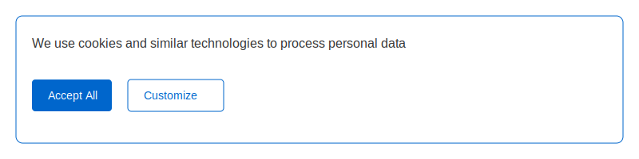

<div align="center">
  <a href="https://fidiora.com">
    
  </a>

  <h1>Lightweight Cookie Consent</h1>
  <p>A lightweight, robust, and customizable cookie consent solution that helps websites comply with privacy regulations like GDPR and CCPA.</p>
  <p>
    <a href="https://fidiora.com">
      
    </a>
    <a href="https://github.com/Fidiora/lightweight-cookie-consent/blob/main/LICENSE">
      
    </a>
    <a href="https://github.com/Fidiora/lightweight-cookie-consent/issues">
      
    </a>
  </p>
</div>

## 🚀 Demo

Here's how the cookie consent banner looks and works in different scenarios:

### Default Light Theme


### Dark Theme


### Mobile View


### Customization Example
```javascript
{
  "theme": "custom",
  "colors": {
    "primary": "#0066cc",
    "background": "#ffffff",
    "text": "#333333"
  },
  "position": "bottom-right",
  "animation": "slide-up"
}
```


## ✨ Features

- 🔒 **GDPR and CCPA Compliant**
  - Customizable consent categories
  - Detailed audit logs
  - Privacy-first approach

- 🎨 **Highly Customizable**
  - Multiple themes (Light/Dark)
  - Custom colors and branding
  - Flexible positioning
  - Responsive design

- ⚡ **Lightweight & Fast**
  - < 5KB gzipped
  - No external dependencies
  - Async loading
  - High performance

- 🛠️ **Developer Friendly**
  - Simple API
  - Extensive documentation
  - TypeScript support
  - Easy integration

## 🔧 Installation

1. Clone the repository:
```bash
git clone https://github.com/Fidiora/lightweight-cookie-consent.git
cd lightweight-cookie-consent
```

2. Install dependencies:
```bash
npm install
```

3. Create a `.env` file:
```env
PORT=3001
NODE_ENV=development
CORS_ORIGIN=http://localhost:3000
SESSION_SECRET=your-session-secret
```

4. Start the development server:
```bash
npm run dev
```

## 📖 Usage

### Basic Implementation
```html
<script src="https://cdn.fidiora.com/cookie-consent/v1.0/cookie-consent.min.js"></script>
<script>
  CookieConsent.init({
    privacyPolicy: '/privacy',
    theme: 'light',
    position: 'bottom'
  });
</script>
```

### Advanced Configuration
```javascript
CookieConsent.init({
  privacyPolicy: '/privacy',
  theme: 'custom',
  position: 'bottom-right',
  colors: {
    primary: '#0066cc',
    background: '#ffffff',
    text: '#333333'
  },
  categories: {
    necessary: {
      name: 'Essential',
      required: true
    },
    analytics: {
      name: 'Analytics',
      description: 'Help us improve our website'
    },
    marketing: {
      name: 'Marketing',
      description: 'Personalized content'
    }
  }
});
```

## 📚 Documentation

For detailed documentation, visit our [Documentation Portal](https://consent.fidiora.com/docs).

## 🤝 Contributing

We welcome contributions! Please read our [Contributing Guidelines](CONTRIBUTING.md) for details.

## 🔒 Security

Security is our top priority. Read our [Security Policy](SECURITY.md) for reporting vulnerabilities.

## 💬 Support

For support:
- Visit [fidiora.com](https://fidiora.com)
- Join our [Community](https://fidiora.com/community)
- Open an [Issue](https://github.com/Fidiora/lightweight-cookie-consent/issues)

## 📄 License

MIT © [Fidiora](https://fidiora.com) - See [LICENSE](LICENSE)

---

<div align="center">
  <sub>Built with ❤️ by the <a href="https://fidiora.com">Fidiora</a> community.</sub>
</div>
